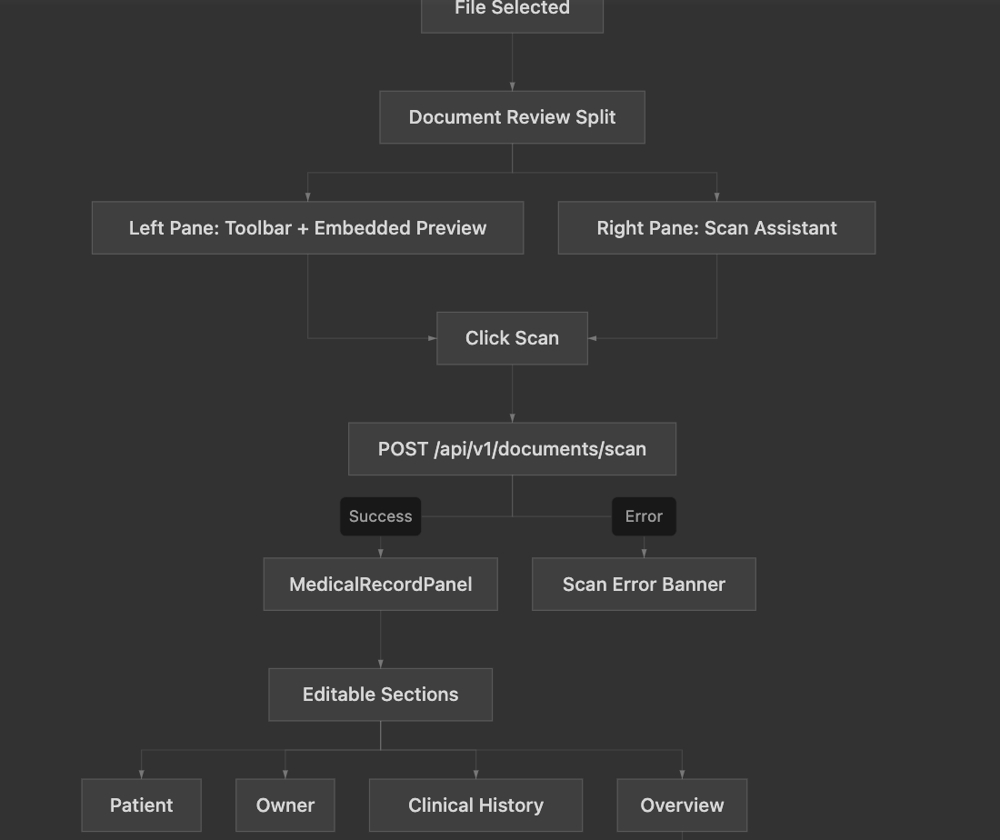
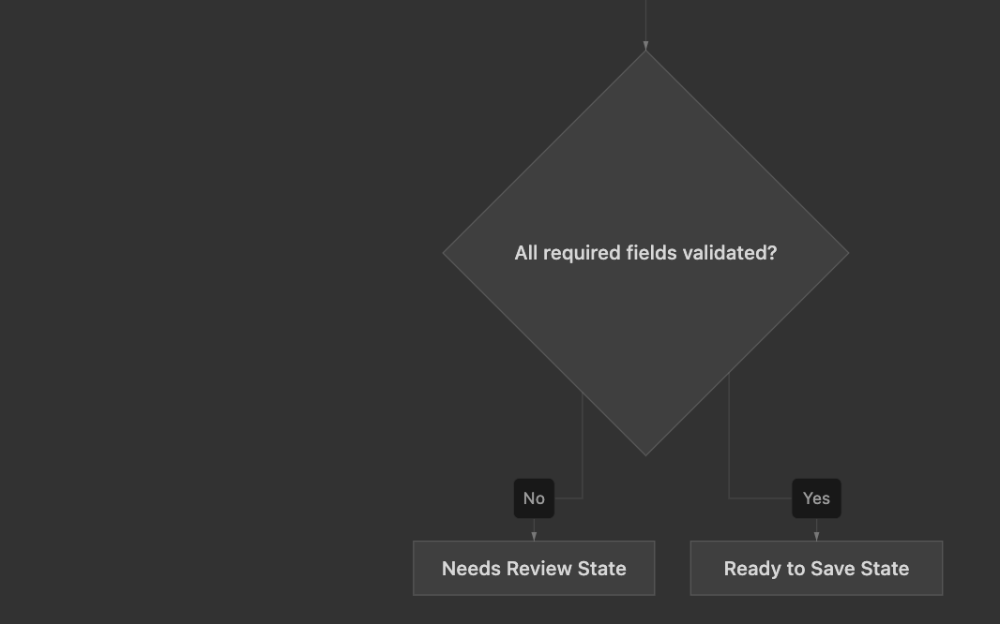
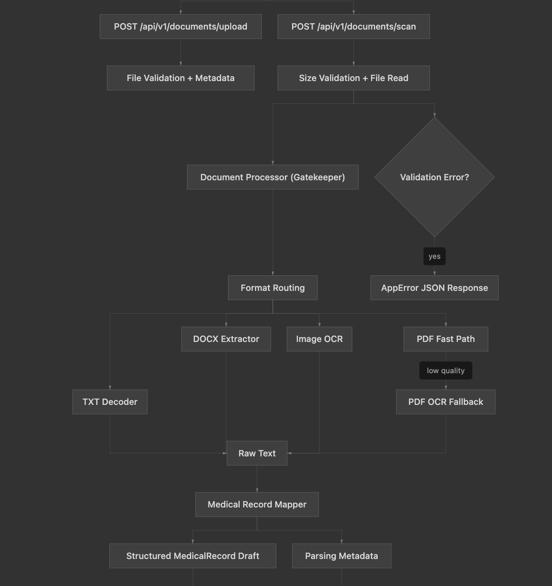
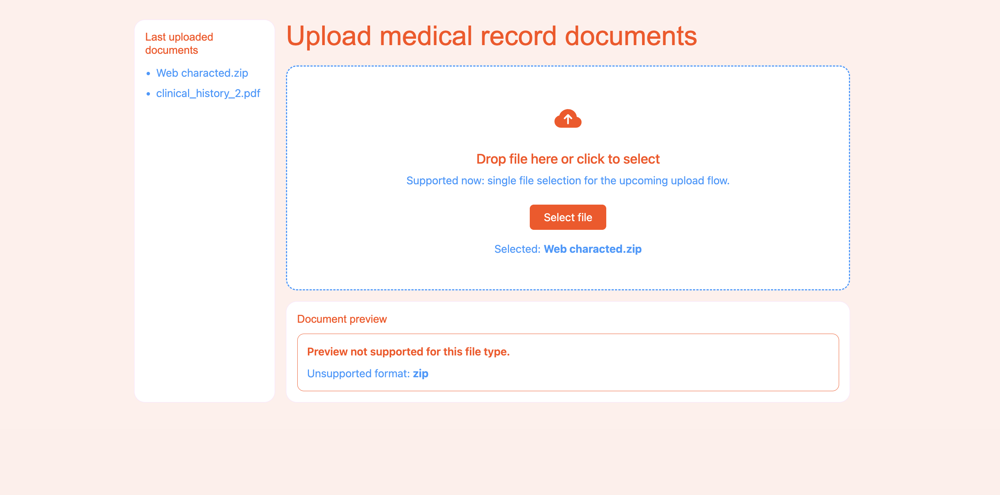
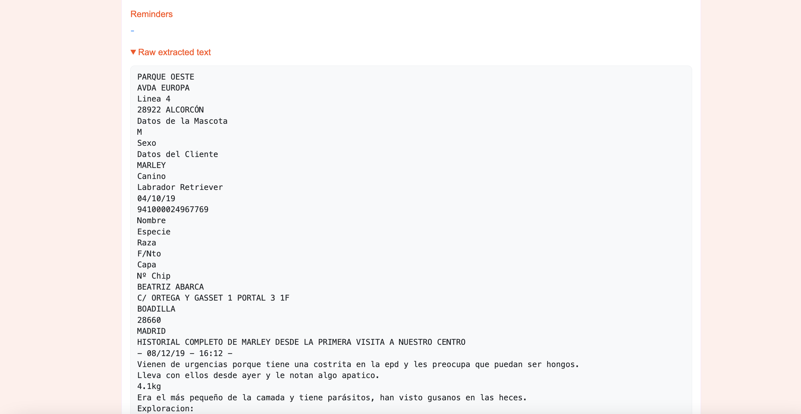
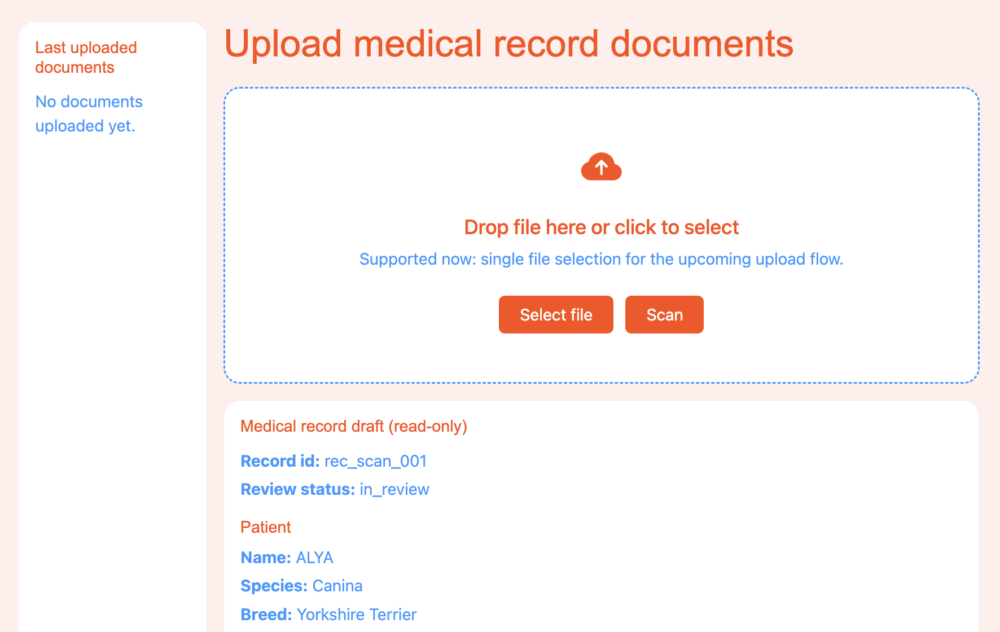
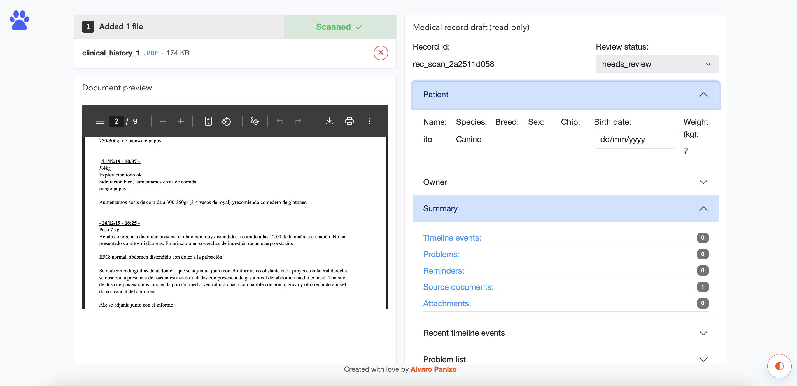

# HappyVet Pulse Documentation

## Demo

▶️ [Watch demo video](docs/images/vetpulsedemo.mp4)

## Frontend Overview
The frontend is a React + Vite application focused on a human-in-the-loop review flow for veterinary documents.
Users upload a file, preview it, run scan, and then validate extracted data in an editable clinical form (Patient, Owner, Clinical History, Overview).
UI text is centralized in uiContent.json, styles are driven by theme.css tokens (light/dark), and API interactions are isolated in hooks.

## Backend Overview
The backend is a FastAPI service that receives uploaded files, runs document extraction/parsing, maps results into a structured medical-record schema, and returns a review-ready payload for the frontend.
It includes parsing metadata, quality/error handling, and size guards (including 1GB upload/scan limits).

## TL;DR Plan and implementation 

HappyVet Pulse is a Human-in-the-Loop veterinary IDP prototype:

1. Upload fragmented medical documents
2. Extract and structure clinically useful data
3. Review and correct extracted fields in the UI

### Iteration snapshots

#### Milestone 1 - Shell foundation
- Backend/frontend scaffold, Docker/Compose, test baseline, CI baseline.

#### Milestone 2 - Upload + preview + API wiring
- Upload UI, document preview, metadata endpoint integration, layered tests.

#### Milestone 3 - Structured record baseline 
- Backend medical-record schema + frontend read-only structured render.
- Mock scan endpoint + Scan button to validate end-to-end model rendering.
- CORS enabled for local FE dev origin.
- Shared JSON Schema contract validation on both backend and frontend tests.

#### Milestone 4 - Document ingestion, parsing architecture, performance-first "Gatekeeper" strategy
- Document ingestion with a swappable parsing architecture and a real scan ingestion path, then pivot to a performance-first "Gatekeeper" strategy for lower latency and leaner runtime.
- Convert files into structured text and map into `MedicalRecordDraft`.
- Add parsing integrity metadata in response.
- Pivot from heavy ML OCR stack to a lean Gatekeeper routing system with fast-path parsing and Tesseract fallback.

#### Milestone 5 - UI polish + parsing-ready frontend framing
- Layered upload experience: marketing header (rotating “Convert …” line), large square dropzone (icon + title + caption), attached footer (support line + sample document pills as mock).
- Review panel evolution: `MedicalRecordPanel` migrated from read-only summary blocks to editable form controls with collapsible sections (patient, owner, timeline, problem list, reminders, raw extracted text).
- Split-view behavior hardening: after scan, left/right columns remain height-bounded and each pane can scroll internally (instead of both growing with expanded form sections).

#### Milestone 6 - Backend parsing hardening for demo-ready structured output
- Focus moves to backend parsing quality from raw extraction to mapped model output.
- Add stronger defaults and minimum data requirements so partially parsed documents still return a stable, review-friendly payload.
- Build minimal showcase/demo data paths to validate behavior across different file types.

#### Milestone 7 - Product hardening, bugfixing, loading feedback, and usability improvements
- Consolidate parser/UI reliability fixes and reduce known edge-case regressions.
- Improve perceived responsiveness with clearer loading states and animations in key user actions.
- Raise day-to-day review usability with interaction and accessibility quality-of-life improvements.

---

## Standard Plan and Implementation Notes

## Milestone 1

### Goal
Establish a runnable baseline for parallel backend/frontend development.

### Scope
- FastAPI app shell with `GET /health`.
- React + Vite app shell.
- Dockerfiles + `docker-compose.yml`.
- Initial backend/frontend tests.
- GitHub Actions for automated checks.

### Delivered
- Working local stack and CI baseline.
- Basic quality gates to support next milestones safely.

### Testing and CI
- Backend test coverage for health baseline.
- Frontend test coverage for shell rendering baseline.
- CI workflow running backend + frontend tests on `push` and `pull_request`.

### Next step
- Build first vertical slice for document upload and metadata wiring.

## Milestone 2

### Goal
Deliver first end-to-end upload vertical slice with robust UX and validation signals.

### Scope
- Build upload UI with React-Bootstrap and Bootstrap Icons.
- Add backend upload endpoint returning lightweight metadata.
- Wire FE upload action to backend response rendering.
- Improve reliability through error handling, logging, and tests.

### Delivered / Implementation
- Backend:
  - Endpoint: `POST /api/v1/documents/upload`
  - Input: multipart file (`file`)
  - Output:
    - `filename`
    - `content_type`
    - `size_bytes`
    - `text_preview`
  - Architecture improvements:
    - modular routes (`health`, `documents`)
    - centralized errors (`AppError` + global handlers)
    - standardized error payload: `{"error":{"code":"...","message":"..."}}`
    - centralized logging utility used in upload flow
- Frontend:
  - Component architecture:
    - `UploadPanel`
    - `RecentDocumentsPanel`
    - `DocumentPreview`
    - `UploadResultCard`
    - `App` as orchestration layer
  - Upload/preview behavior:
    - click-to-select + drag/drop
    - supported preview: image, PDF, TXT
    - DOCX explicit fallback
    - unsupported file fallback
  - API wiring:
    - `uploadDocument` hook
    - metadata card from API response
    - upload loading/error states
  - UI consistency:
    - centralized strings (`uiContent.json`)
    - runtime UI content validation
    - (Milestone 5+) visual tokens in `theme.css`; legacy `uiTheme.js` removed
  - Environment:
    - `BACKEND_API_BASE_URL` for frontend API target

### Testing and CI
- Backend:
  - health
  - upload success
  - empty file error
  - missing file validation
- Frontend:
  - integration tests for upload + metadata/error rendering
  - utility tests for preview classification
- E2E (Playwright smoke):
  - successful TXT upload metadata visibility
  - API failure upload error visibility
- CI pipeline:
  - backend tests
  - frontend unit/integration tests
  - frontend E2E smoke tests (depends on FE tests)

### Next step
- Introduce structured medical record model and read-only render baseline.

## Milestone 3

### Goal
Prepare the medical record structured model and validate model rendering in the current UI.

### Scope
- Define canonical medical record draft schema on backend.
- Mirror schema shape in frontend state.
- Render read-only structured medical record panel.
- Add mocked scan round-trip (backend -> frontend display).
- Add contract guards to prevent FE/BE model drift.
- Keep persistence/edit-save out of scope.

### Delivered / Implementation
- Backend:
  - Canonical schema at `backend/app/schemas/medical_record.py`
  - Mock scan endpoint at `POST /api/v1/documents/scan`
  - CORS enabled for local FE dev origins (`localhost:5173`, `127.0.0.1:5173`)
- Frontend:
  - Read-only panel component: `frontend/src/components/MedicalRecordPanel.jsx`
  - State bootstrapping:
    - `frontend/src/data/medicalRecordEmptyState.js`
    - `frontend/src/data/medicalRecordMockData.js`
    - `frontend/src/data/medicalRecordState.js`
  - Production-safety rule: mock medical data never shown in production builds.
  - `Scan` button in upload panel triggers backend scan and updates medical record panel.
- Shared contract:
  - JSON Schema contract at `contracts/medical_record.schema.json`
  - Backend validates `/scan` payload against shared schema in tests.
  - Frontend validates empty/mock states against same schema with Ajv.

### Testing and CI
- Backend tests cover:
  - scan success payload shape
  - scan response Pydantic validity
  - scan response JSON Schema contract validity
  - CORS preflight behavior for frontend dev origin
- Frontend tests cover:
  - successful scan updates rendered record data
  - scan error rendering
  - shared JSON Schema contract checks for empty/mock states
- Existing CI test jobs run these checks automatically.

### Next step
- Move from read-only state to per-field editable review workflow while preserving schema parity and traceability metadata.

## Milestone 4

### Goal
Implement intelligent document ingestion with a swappable parsing architecture and a real scan ingestion path, then pivot to a performance-first "Gatekeeper" strategy for lower latency and leaner runtime.

### Scope
- Introduce `DocumentProcessor` abstraction and default processor implementation.
- Update `POST /api/v1/documents/scan` to ingest multipart files (`PDF`, `image`, `DOCX`, `TXT`).
- Convert files into structured text and map into `MedicalRecordDraft`.
- Add parsing integrity metadata in response.
- Pivot from heavy ML OCR stack to a lean Gatekeeper routing system with fast-path parsing and Tesseract fallback.

### Delivered / Implementation
- Backend architecture:
  - `backend/app/document_processing/base.py` (processor interface)
  - `backend/app/document_processing/gatekeeper_processor.py` (routing/orchestration)
  - `backend/app/document_processing/extractors.py` (format-specific extraction functions)
  - `backend/app/document_processing/quality_gate.py` (extraction sufficiency heuristic)
  - `backend/app/document_processing/factory.py` (swappable engine selection)
  - `backend/app/document_processing/medical_record_mapper.py` (markdown -> schema mapping)
  - `backend/app/document_processing/models.py` (`DocumentProcessingResult`, `ParsingMetadata`)
- Gatekeeper routing (performance pivot):
  - `.txt` -> native decode path (fast)
  - `.docx` -> `python-docx` extraction (fast)
  - `.pdf` -> `PyMuPDF` text-layer extraction first (fast path), then `pdf2image` + `pytesseract` fallback when insufficient
  - image formats (`.jpg`, `.jpeg`, `.png`, `.webp`) -> `pytesseract`
- Decision-maker heuristic (`is_extraction_sufficient`) uses a score-based gate:
  - hard minimum: reject when extracted text length `< 150`
  - expected text estimate: `page_count * estimated_chars_per_page`
  - structural penalties: subtract penalties for detected images and tables
  - accept when extraction coverage ratio meets threshold (estimated available text vs extracted text)
  - rejected PDF fast-path extractions trigger `tesseract_fallback`
- API integration:
  - `/scan` now accepts `UploadFile`
  - parsing output is mapped into:
    - `MedicalRecordDraft.source_documents[0].raw_text`
  - backend applies lightweight pre-structuring heuristics to prefill core patient fields when recognizable (name, species, breed, sex, chip, weight)
  - response includes top-level `parsing_metadata`
- Parsing metadata fields:
  - `engine`
  - `extraction_method` (`fast_path` | `tesseract_fallback`)
  - `latency_ms`
  - `extracted_char_count`
  - `meaningful_text`
  - `integrity_score`
  - `reason` (optional)
- Error policy:
  - low-integrity extraction returns `422` with `PARSING_INTEGRITY_LOW`
- Dependency/runtime pivot:
  - removed Docling, PyTorch, and EasyOCR dependency chains
  - added `PyMuPDF`, `python-docx`, `pdf2image`, `pytesseract`
  - kept `python:3.11-slim` base image
  - backend Dockerfile uses multi-stage build and installs OCR/PDF system packages:
    - `tesseract-ocr`
    - `libtesseract-dev`
    - `poppler-utils`
    - `libgl1`, `libglib2.0-0`

### Testing and CI
- Backend tests (`backend/tests/test_upload.py`) cover:
  - multipart `/scan` flow
  - mapped markdown in schema payload
  - top-level parsing metadata
  - low-quality parse error path
  - CORS preflight
- Frontend tests (`frontend/src/App.test.jsx`) cover:
  - scan requires selected file
  - multipart scan request (`FormData` with `file`)
  - scan success rendering
  - scan parsing error rendering
  - structured panel raw text section (collapsible) rendering
- Contract tests:
  - shared schema at `contracts/medical_record.schema.json`
  - backend and frontend validate compatibility including `extraction_method` and `latency_ms` in `parsing_metadata`
- E2E coverage:
  - existing mocked smoke tests remain at `frontend/tests/e2e/upload-smoke.spec.js`
  - real scan E2E tests added at `frontend/tests/e2e/scan-real.spec.js` (no API route mocking)
  - real E2E uses fixture files from `frontend/tests/e2e/fixtures/`
  - supported fixture extensions: `.txt`, `.pdf`, `.docx`, `.png`, `.jpg`, `.jpeg`, `.webp`
  - fail-fast backend availability pre-check:
    - script: `frontend/scripts/check-backend-health.mjs`
    - command: `npm run test:e2e:real`
    - behavior: exits with clear error message if `http://127.0.0.1:8000/health` is unavailable

### Next step
- Expand deterministic mapping beyond patient basics (timeline, reminders, problem list) while keeping raw extracted text visible as the reliable fallback for human review.

## Milestone 5

### Goal
Polish the frontend experience and establish cleaner UI/text foundations that support the upcoming, better-structured parsing workflow—without changing backend contracts in this slice.

### Scope
- Refine the first upload step: layout, clinical-history messaging, drag-and-drop affordances, and optional sample-document hints.
- Remove inline/hardcoded styling from JSX; centralize tokens and components in CSS.
- Keep all copy and structured lists (including mock samples) in `uiContent.json` with runtime validation.
- Preserve preview + scan + structured panel flows and existing tests.

### Delivered / Implementation

**Upload screen layout (`App.jsx` upload step)**  
- **Header:** Two-line hero—line 1 is `Convert` plus CSS-animated rotating words (`files`, `documents`, `PDFs`, `docs`, `txt`, `images`); line 2 is `into clinical patient records`. Keys: `app.uploadHeaderLine1Prefix`, `app.uploadHeaderLine2`. Uses highlight color token where specified in `theme.css`.  
- **Brand bubble (top-left):** Fixed-position circle showing `frontend/public/vetpulse-icon.svg` (`/vetpulse-icon.svg`).  
- **Floating FAB (bottom-right):** Placeholder for future dark mode; label from `app.themeFabAriaLabel`.  
- **Main drop area:** `UploadPanel` inside `hv-upload-main` (centered, uses most of the viewport height).

**Dropzone (`UploadPanel.jsx` + `UploadDropzoneFooter.jsx` + `MaterialUploadIcon.jsx`)**  
- Single **Card**: primary zone is **click + keyboard** (`Card.Body`, `role="button"`, Enter/Space opens file input)—no separate browse button.  
- **Material-style upload icon** via inline SVG component (`MaterialUploadIcon.jsx`).  
- **Copy:** `uploadPanel.primaryLabel` (title), `uploadPanel.caption` (subtitle under title).  
- **Attached footer** (`UploadDropzoneFooter.jsx`): `footerSupportLine`, `samplePillsIntro`, and `sampleFiles` (array of `{ "fileName": "..." }`) rendered as small pills with a document glyph; clicks on the footer do not open the file picker (mock only until wired).  
- **Hidden file input** unchanged; whole body still receives drag events on the card.

**Full-window drag capture**  
- While a **file** drag is active, a **fixed overlay** (`hv-page-drop-layer`, high z-index) covers the UI—including FAB and brand bubble—and accepts drop; inner rounded panel uses RGB + alpha tokens (`--hv-color-accent-soft-highlight-rgb`, `--hv-overlay-alpha`).  
- Optional centered **hint** (`uploadPanel.dragOverlayHint`) with readable styling.  
- `body.hv-drag-active` sets **`cursor: copy`** during drag.  
- Avoid creating lower stacking contexts on the upload shell so the overlay stays on top (e.g. no stray `z-index` on wrappers that trap the overlay).

**Styling**  
- **`frontend/src/styles/theme.css`:** `:root` design tokens (colors, fonts, radii, shadows, overlay alpha, dropzone border); sections for layout, upload, preview, modal; class prefix `hv-`.  
- **`frontend/src/main.jsx`:** import order Bootstrap → `theme.css`.  
- **Removed:** `frontend/src/styles/uiTheme.js` (do not reintroduce).

**Static assets**  
- **`frontend/public/`:** files served at URL root (e.g. `/vetpulse-icon.svg`).  
- **`frontend/index.html`:** `<link rel="icon" href="/vetpulse-icon.svg" type="image/svg+xml" />`.

**UI content & validation**  
- **`frontend/src/data/uiContent.json`:** upload keys include `primaryLabel`, `caption`, `footerSupportLine`, `samplePillsIntro`, `sampleFiles`, `dragOverlayHint`, header lines, `themeFabAriaLabel`, etc.  
- **`frontend/src/utils/validateUiContent.js`:** string keys as before; **`uploadPanel.sampleFiles`** must be a non-empty array of objects each with non-empty **`fileName`**.

**Document review flow updates (Milestone 5 latest slice)**  
- **Single review split lifecycle:** once a file is selected, the app stays in the same review split container; scan completion no longer remounts the full page wrapper.  
- **Left panel continuity after scan:** left column always keeps `DocumentReviewToolbar` + embedded `DocumentPreview`; it no longer swaps to a post-scan placeholder panel.  
- **Scan CTA lifecycle in toolbar:**  
  - idle: actionable **Scan** button with tooltip  
  - scanning: button is disabled, greyed out, shows **Scanning** label + inline loading spinner  
  - completed: button is replaced with **Scanned** status + green checkmark  
- **Right panel behavior:** while scanning, right pane keeps scanning/skeleton state; after success, it transitions to `MedicalRecordPanel` without the previous full-step reload effect.  
- **Reset removal:** the previous “Reset working page” action and confirmation modal were removed from the review flow.  
- **File removal behavior:** confirming “remove file” now returns to upload and also resets scan completion + structured medical record state to initial defaults.  
- **Component cleanup:** obsolete post-scan left placeholder component was removed; toolbar now owns scan progress/completion feedback.
- **Editable structured form:** `MedicalRecordPanel` now keeps a local editable draft seeded from backend scan payload. Core scalar and nested fields are rendered as editable controls (`Form.Control` / `Form.Select`) rather than static text-only values.
- **Current edit scope:** editable record metadata (`record_id`, `review.status`), patient/owner field values, recent timeline rows, problem rows, reminder rows, and raw extracted text in textarea form.
- **Defensive shaping:** panel state normalizes partial backend payloads so missing optional fields do not break rendering.
- **Right/left pane overflow behavior:** split view uses constrained pane heights with internal scrolling to keep left preview stable while long right-side forms remain fully accessible.
- **JSX maintainability pass:** repeated rendering branches were reduced in several components (`App`, `DocumentPreview`, split layout and footer/layout helpers) while preserving behavior.

### Testing and CI
- Frontend tests: `frontend/src/App.test.jsx`, `frontend/src/contracts/medicalRecordContract.test.js`, `frontend/src/utils/filePreview.test.js`.  
- Updated test expectations for the latest review flow:
  - successful scan keeps document preview visible
  - scanned status text appears in toolbar
  - reset-flow tests/assertions removed
- Additional milestone-5 updates validated in unit tests:
  - form-based medical record values continue rendering after scan (form controls now queried by value where relevant)
  - collapsible raw-text section remains present after scan while supporting editable textarea content
- No backend API changes required for Milestone 5 UI-only deliverables; existing CI jobs unchanged.

### Next step
- Wire **sample pills** to real behaviors (e.g. load bundled fixtures or drive scan with sample paths).  
- Implement **dark mode** behind the FAB and document theme tokens.  
- Lift editable medical-record draft state from panel-local scope to app-level persistence + add save/approve API path.
- Optional: add/update **screenshot** under `docs/images/` for Milestone 5 upload UI.

## Milestone 6

### Goal
Improve backend parsing reliability by transforming raw extracted text into a more complete, deterministic structured model using sensible defaults, minimum requirements, and demo-ready baseline data.

### Scope
- Tighten parser-to-model mapping quality for `POST /api/v1/documents/scan`.
- Define and enforce minimum required structured fields before returning successful parse results.
- Introduce default/fallback value rules for missing but expected clinical fields.
- Add a minimal showcase data strategy to demonstrate consistent behavior across multiple input formats.
- Keep response shape aligned with shared contract (`contracts/medical_record.schema.json`) and frontend editable review flow.

### Delivered / Implementation
- Backend parsing quality and observability:
  - added parser-to-model coverage metric in `/scan` metadata:
    - `mapping_coverage_pct`
    - `mapped_fields_count`
    - `total_fields_count`
  - updated mapping coverage calculation to match the current model (scalar field groups + timeline list group).
  - added `backend/scripts/inspect_scan_mapping.py` to inspect extracted text vs mapped model payload quickly.
- Mapper hardening and extraction quality:
  - added timeline event extraction from raw text and normalized event creation.
  - strengthened multilingual label detection (including Spanish variations like `nacimiento`) and fuzzy/robust parsing with `dateparser` + `rapidfuzz`.
  - improved patient/owner extraction reliability (species normalization, better breed/name/birth-date/chip/weight handling).
  - refactored mapper architecture into smaller concern-specific modules to reduce monolithic complexity and improve deterministic tuning:
    - `mapper_constants.py`
    - `mapper_common.py`
    - `mapper_key_value.py`
    - `mapper_scalar_rules.py`
    - `mapper_timeline.py`
    - `mapper_coverage.py`
    - kept `medical_record_mapper.py` as a thin orchestration layer.
  - added robust host-safe fuzzy fallback behavior when `rapidfuzz` is unavailable (stdlib matcher fallback), so local scripts can still run.
  - hardened scalar extraction normalization/validation:
    - patient/owner demographic-block-first extraction to avoid leaking timeline narrative into patient/owner fields.
    - owner name priority: `Primary Account Holder`/owner labels preferred over representative labels.
    - stricter owner contact validation to reject OCR noise:
      - email must match email pattern.
      - phone accepts realistic international formats and rejects temperature/noise artifacts.
      - address requires meaningful text and rejects temperature-like captures.
  - added mapper diagnostics/report tooling:
    - `backend/scripts/report_mapper_provenance.py` (and container path mirror under `backend/app/scripts/`) to report:
      - field provenance (`matched_key`, `line_index`, `match_type`)
      - extraction metrics
      - scalar confidence rollups (`approved > 0.8`, filled <= 0.8, empty, totals).
  - timeline parsing hardening for explicit clinical-history files:
    - event parsing now scopes to clinical section and prefers explicit `EVENT N` blocks.
    - date extraction now prioritizes labeled `Date`/`Fecha` lines with strict parsing.
    - event payload routing improved:
      - explicit `Anamnesis` captured into `anamnesis`
      - diagnosis/treatment/test labels routed into their respective lists
      - remaining clinically relevant lines routed to `assessment`.
    - prevented demographic/header noise from becoming timeline/problem events.
    - controlled derived event creation (`problem`/`reminder`) when explicit event blocks are present.
    - added timeline deduplication/signature filtering to reduce duplicated OCR/page-repeated events on long records.
  - added derived event logic:
    - `problem` events generated from repeated/clinical diagnosis mentions (`active`/`resolved`/`recurrent` signals in assessment/title).
    - `reminder` events generated from timeline context (`pending`/`done` behavior for past dates).
- Model and contract evolution:
  - renamed schema definition to `medicalRecordFinal`.
  - expanded owner contract: `name`, `surname`, `phone_number`, `email` required; `address` optional.
  - added/used field statuses and review automation:
    - `empty`, `pending`, `approved`, `automatically_approved`, `edited`
    - auto-approve review when parsing `integrity_score > 0.8`.
  - removed `problem_list` and `reminders` as top-level model arrays; consolidated them into `timeline` with new event types:
    - `event_type: "problem"`
    - `event_type: "reminder"`
- Frontend review workflow overhaul:
  - reworked `MedicalRecordPanel` into four sections:
    - `Patient`
    - `Owner`
    - `Clinical History`
    - `Overview`
  - standardized monochromatic iconography using `lucide-react` across toolbar, section headers, timeline, and status visuals.
  - improved split layout behavior:
    - pre-scan: `50/50`
    - post-scan: `35/65`
  - improved field UX:
    - consistent field heights
    - stronger required-field outline/warnings
    - field-level status actions for manual approval/edited state
    - empty-state semantics for unfilled extracted fields
  - rebuilt clinical history UX as tile-based events:
    - compact header with icon/chips
    - expand/collapse editing
    - add/remove flows
    - bulk select all/none + bulk delete with confirmation
    - event-level required validation and status propagation to section-level approval
    - collapse behavior fixed to trigger only when the final required field completes approval (with 5s idle debounce for text edits).
  - summary/overview hardening:
    - dynamic `Patient/Owner/History` reviewed counts
    - dynamic totals for `Approved automatic`, `Approved / Edited by user`, `Needs review`
    - all required-field computations aligned with contract-validated UI required-field config.
  - removed raw extracted text from the `Overview` summary presentation for the milestone wrap-up.
  - maintainability-focused refactor pass on the medical record frontend:
    - extracted a shared confirm dialog primitive and removed duplicated modal markup.
    - centralized status and field option constants in dedicated modules.
    - split the previously large `MedicalRecordPanel` into section-level components (`Patient`, `Owner`, `Clinical History`, `Overview`) and dedicated timeline editor component.
    - moved timeline/model/status logic into feature hooks and selectors (`useTimelineSelection`, `useSectionCollapse`, draft controller hook, computed selectors) so the panel acts mainly as orchestration.
    - introduced a `frontend/src/features/medical-record/` structure and physically migrated medical record-specific components/constants/utils there.
    - removed legacy icon wrapper files in `frontend/src/components/icons/` and switched toolbar/upload to direct `lucide-react` icons.
- Milestone 6 close-out stabilization notes:
  - finalized section-level status propagation rules so required-field completion is the single source of truth for event and section approval.
  - aligned overview counts with required-field definitions to avoid contract/UI drift on reviewed totals.
  - documented the milestone as complete and ready for milestone-7 quality hardening slices without reopening schema-shape decisions.

### Testing and CI
- Added/updated backend tests in `backend/tests/test_upload.py` for:
  - mapping coverage metadata changes
  - parser-derived timeline problem/reminder events
  - timeline/status behavior aligned with model changes.
  - demographic-block-first patient/owner extraction behavior.
  - owner-name priority selection (`Primary Account Holder` vs representative labels).
  - owner email/phone/address noise-rejection regressions.
  - explicit-event timeline block parsing, payload routing, and deduplication behavior on cat-style chronology.
- Added/updated frontend tests (`App`, contract tests, e2e smoke/real) for:
  - updated clinical history header and section behavior
  - required-field alignment with contract expectations
  - timeline event validation and interaction flows.
- Frontend refactor stability checks:
  - repeated local validation of `App` and contract suites after each extraction/move step to ensure behavior parity while reducing component size/complexity.
- Milestone 6 end-state checks:
  - validated required-field status propagation in timeline rows and section summaries against shared contract assumptions.
  - kept milestone-6 behavior stable while milestone-7 fixes were layered on top (no contract regressions introduced).
- Real benchmark command kept as non-blocking baseline:
  - `cd frontend && npm run test:e2e:real -- --grep "real scan benchmark: report mapping coverage from fixtures"`
- CI workflow remains the same pipeline shape, with milestone-specific assertions expanded.

### Next step
- Milestone 6 wrap-up complete. Next milestone can focus on persistence/workflow closure (save/review lifecycle APIs), plus additional parser quality gains from expanded multilingual fixtures.

## Milestone 7

### Goal
Harden the current end-to-end workflow by fixing high-impact bugs, improving loading feedback, and raising overall usability for the human review experience.

### Scope
- Reliability hardening across backend parsing and frontend review interactions.
- Bugfix pass for regressions and edge cases discovered during milestone 6 validation.
- Add/standardize loading animations and progress feedback for upload, scan, and heavy UI transitions.
- Improve usability and accessibility in the review flow (clarity, focus, affordances, and interaction smoothness).
- Keep shared schema contract compatibility and existing core API routes stable while improving behavior quality.

### Delivered / Implementation
- Timeline and status hardening:
  - fixed timeline required-field status propagation so untouched `automatically_approved` fields remain stable when another field is edited.
  - corrected timeline event completion logic to treat required fields in `approved`, `automatically_approved`, or `edited` as valid completion states.
  - aligned section-level status aggregation to include `automatically_approved` consistently in timeline and overview calculations.
- Header and status UX improvements:
  - clinical header species icon is now driven by confirmed species status (`approved`, `automatically_approved`, `edited`) and reflected in the top-level header.
  - section header icon colors are status-driven (`needs_review` warning palette, `approved` success palette, `edited` muted palette).
  - added top-level “Ready to save” badge with green check in clinical header when Patient, Owner, and Clinical History sections are fully validated.
  - overview header status now reflects overall document review state instead of fixed approved styling.
- Overview consistency and usability:
  - standardized counts to `Partial / Total` pill format across overview rows.
  - completion pills turn green when `Partial = Total`.
  - removed check/warning icons from overview breakdown rows and retained text + counts.
  - added tooltips on breakdown labels (`Automatically approved`, `Approved / Edited by user`, `Needs review`).
- Upload and scan reliability:
  - added hard 1GB upload/scan limit on both frontend and backend.
  - backend validates oversized requests from `Content-Length` and payload-size checks, returning `413 FILE_TOO_LARGE`.
  - frontend blocks oversized files pre-request with clear error messaging.
  - added dev-only synthetic `big_file` sample (`?dev=true`) for oversized-file testing without real large assets.
  - refactored synthetic file generation to override `File.size` safely and avoid heavy memory allocation.
- Preview and media rendering:
  - improved image preview containers with bounded height + scrolling behavior.
  - embedded image preview now supports width-first render with vertical scrolling for tall images.
  - restored embedded non-image behavior (e.g. `.docx`, `.txt`) to small centered icon thumbnail stage.
  - fixed image type detection to include extension-based fallback when MIME type is missing/incorrect.
  - stabilized blob URL lifecycle in preview components to avoid premature URL revocation and false image fallback loads.
  - centered embedded `.docx` quick preview icon + title in the preview stage.
- Loading/engagement enhancements:
  - removed right-panel skeleton placeholder and kept focused scan-state feedback.
  - added scan CTA inactivity nudge (subtle bounce/glow) after 5s inactivity post-upload, until scan starts.
  - integrated Rive animation support (`@rive-app/react-canvas`) for right-panel scan assistant:
    - idle state supports blink loop.
    - scan state triggers movement timelines.
  - added rotating scan quotes under the Rive panel:
    - static pre-scan message: `Ready to scan your files`.
    - scan-time randomized quote rotation with random start and 3s cadence.
    - content moved to `uiContent.json` and validated in runtime schema checks.
- Theme and UI hardening:
  - completed dark-mode toggle wiring with persisted preference and default light first-load behavior.
  - audited and extracted remaining hardcoded CSS colors into variables where feasible; updated light/dark mappings.
  - ensured cards/accordion containers inherit theme variables (not only headings), so full form surfaces change by theme.

### Testing and CI
- Backend tests:
  - added oversized request coverage for `/api/v1/documents/upload` and `/api/v1/documents/scan` (`413 FILE_TOO_LARGE` via request headers).
- Frontend tests:
  - added scan-blocking coverage for >1GB file behavior in `frontend/src/App.test.jsx`.
  - updated/maintained `App` and `filePreview` suites while adding Rive/rotator and preview lifecycle changes.
  - validated image preview classification fallback behavior via extension-aware detection.
- Quality gates:
  - repeated local verification after each milestone-7 slice with:
    - `npm run test -- src/App.test.jsx`
    - `npm run test -- src/App.test.jsx src/utils/filePreview.test.js`
  - milestone-7 changes kept shared contract compatibility intact (`contracts/medical_record.schema.json` unchanged in shape).

### Next step
- Milestone 7 is functionally complete for hardening + UX scope.
- Next milestone can focus on persistence/closure workflows:
  - save/finalize clinical record API flow,
  - audit trail for reviewer actions,
  - explicit post-save success navigation and retrieval UX.
