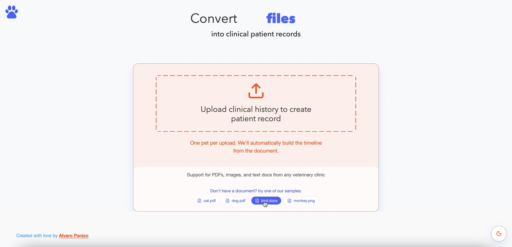
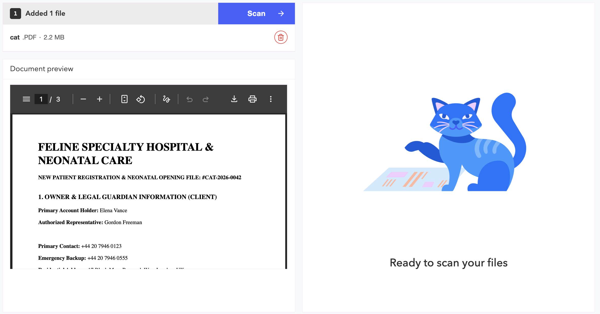
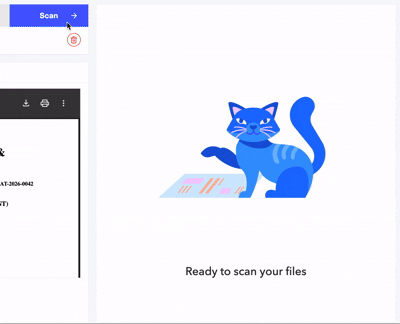
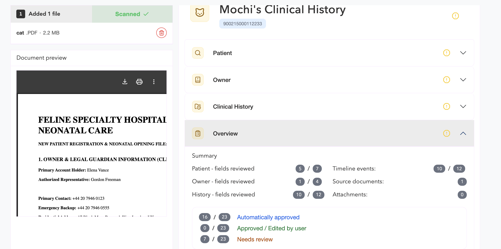
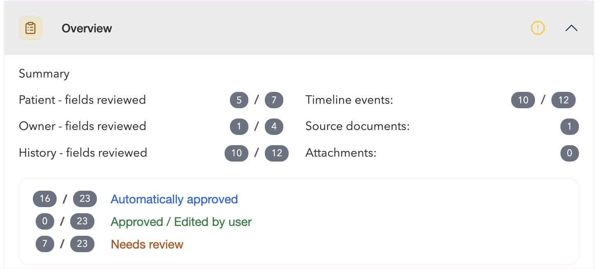
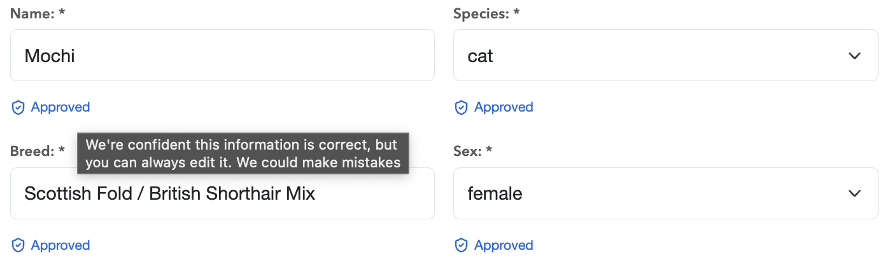
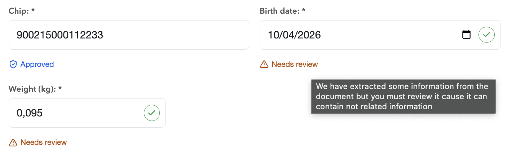
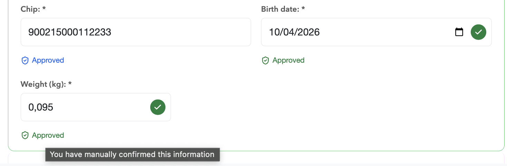
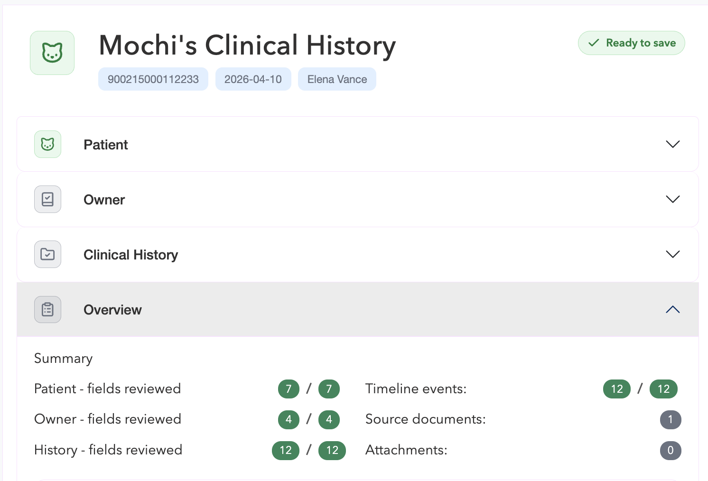

# HappyVet Pulse

Lean Human-in-the-Loop IDP foundation for veterinary medical records.
Welcome to VetPulse.

VetPulse helps you convert veterinary documents into structured clinical records in seconds.

## How to use

You can upload your own file, or quickly test the experience with one of our predefined sample documents.



Once a document is uploaded, you’ll see an instant preview so you can verify it’s the correct file.
At any time, you can remove the document and start again.



When you click Scan, VetPulse reads the file, extracts relevant information, and maps it into a clinical record draft.





You’ll also see an overview of the scan results, summarizing what was interpreted from the original document.



Now, let’s look at how to review that information.

In each section — Patient, Owner, and Clinical History — fields can appear in different states:

Automatically approved: high-confidence values that the system considers reliable.



Needs review: values that require your confirmation.



Empty or incomplete: fields where no reliable value was found.
You can edit and validate any value at any time to ensure medical accuracy and completeness.



After all required fields are reviewed and validated, your clinical record is ready to save.



That’s VetPulse — faster document intake, with human review where it matters most.

## Run with Docker

```bash
docker compose up --build
```

### Endpoints

- Backend: `http://localhost:8000`
- Health check: `http://localhost:8000/health`
- Frontend: `http://localhost:5173`

### Frontend API base URL

- Frontend upload requests use `BACKEND_API_BASE_URL`.
- For local non-Docker runs, copy `frontend/.env.example` to `frontend/.env` and set:
  - `BACKEND_API_BASE_URL=http://localhost:8000`

### Stop and cleanup

```bash
docker compose down
```

